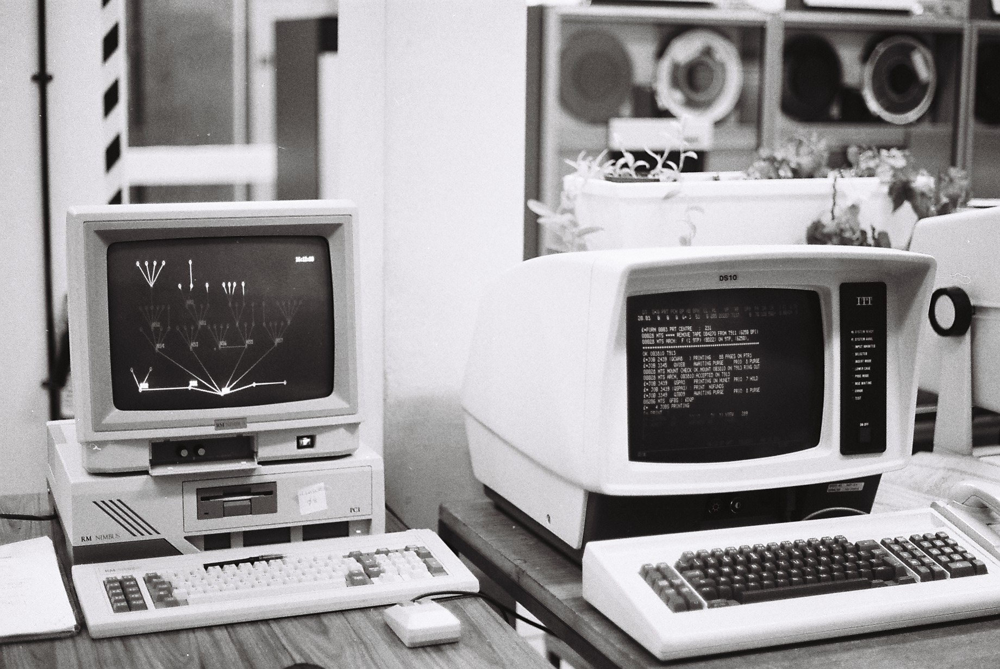

# Command line

In the image below we find a PC on the left, and one of many "dumb terminals" on the right.



Prior to the development of personal computers, computer systems were large and centralized. Access to these large "mainframe" (and later "mini") computers was generally through what were called "dumb" terminals. These terminals had very little to no processing power, and simply "knew" how to display text and read input that would be sent across a wire to the central computer. There terminals where physical extensions of the main computer. Many terminals would be connected to the same computer.

Terminals would, obviously, be used by users to accomplish tasks. There might be a user console, and operator console, and an administrator console. Each of these were particular uses of the hardware terminal.

With the advent of the PC, both the processing (mainframe) and the console (terminal) were merged into one personal device.

Initial computers were not multi-tasking, there were single tasking machines. One user, using a console, would start and run one program.

As PC's evolved, their operating systems became more sophisticated, and we began to see a duplication of the mainframe architecture; that is, a user could have multiple "terminals" (in this case, they would use software, not hardware) that they  would use to access the same core system processor.


So, for modern computers, should we these ways of accessing the computer a terminal? or a console?

As we see from the historical context of the mainframe world, in a sense, we could use these terms inter-changeably. When I'm working as an admin, I may open an admin console. This would be done by running terminal software. Frankly though, these terms are often used synonymously.

## What about shells?

Now, we have a third term that is often used synonymously with the other two -- that is "shell".

When computers began having software terminals, the user needed a  "language" to communicate with the computer. The language we use is presented as a user shell... a wrapper, in a sense, or what has become know as a shell (program), that provides a user interface (through a language) to the system.

On Linux, and most flavors of Unix, the most common shell is BASH (Born Again Shell). This is also the shell used in MacOS (which is actually an extension of Unix).

Microsoft, and the general "PC" market did not evolve from Unix, and therefore developed a different technical approach to creating a terminal, and communicating via a shell to the core computer. There's no need to get into great detail about this for this class, other that to associate what we've already covered with how windows handles things.

In windows, our terminal and shell is commonly called the "command prompt", "command terminal", or "command shell" (NOTE: A prompt is simply a curser that indicates that system is waiting for input). Most modern versions of windows (especially the server variety) have another type of terminal access, that referred to as "Powershell".

## We will use Shells/Terminals/Consoles often in this course...

In this course, it is essential that you become familiar with the basic commands available in Bash and/or windows command prompt (NOTE: With the installation of Git on a PC, we get a Bash command shell. This behaves pretty much the same as the Bash shells found on any Unix and MacOS system). I'd recommend that you get familiar with using the bash shell (and most of my examples will use the bash shell). NOTE: There may be the odd situation where we may need to use the basic windows command prompt - but I will try to keep any such need to a minimum.


## Resources for Learning Bash
You will not be required to develop bash scripts in this course, but if you want to, you can quickly learn how to do such things. For a very thorough introduction to the full "power" afforded by bash, I'd suggest working through the exmples found http://www.tldp.org/LDP/Bash-Beginners-Guide/html/Bash-Beginners-Guide.html, then here http://tldp.org/HOWTO/Bash-Prog-Intro-HOWTO.html and finally here http://www.tldp.org/LDP/abs/html/.

The basic set of 9 bash commands you should be familiar with as follows:
```
pwd
cd
ls
cat
cp
mv
rm
rmdir
mkdir
```

To get help with any of these command, simply add the command line switch --help. For instance, to get help on ls, type

```
ls --help
```

To run a program, you simply type the program name at the command prompt. For instance, if you wish to run a (non-compiled) version of a python program you're writing (which you've saved as hello.py) you would type the following.

```
python hello.py
```

We'll be using git in this course. We will access and use git using the command prompt.

...for instance, to create a local git repo, we type the command

```
git init
```

To see a list of git command, we can type the following:

```
git --help
```

...BUT DON'T GET TOO FAR INTO USING GIT UNTIL WE'VE COVERED IT IN CLASS :)
