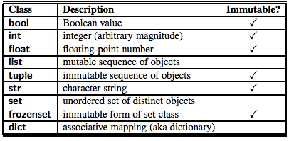

- [w05c14: More on functions and introduction to closures and decorators](#w05c14-more-on-functions-and-introduction-to-closures-and-decorators)
	- [More on argument passing in Python](#more-on-argument-passing-in-python)
		- [Passing an immutable](#passing-an-immutable)
		- [Working with mutable objects as arguments](#working-with-mutable-objects-as-arguments)
			- [Protecting our list as argument (if we need to)](#protecting-our-list-as-argument-if-we-need-to)
	- [Using mutable objects in default arguments](#using-mutable-objects-in-default-arguments)
		- [Overloading Redux: Using None](#overloading-redux-using-none)
	- [Nested Functions](#nested-functions)
	- [Closures](#closures)
	- [Function decorators](#function-decorators)


# w05c14: More on functions and introduction to closures and decorators

Today we will further expand our knowledge of python functions and also introduce the concept of a closure and a decorator.

First, though, we need to be sure we are well grounded in Python's "pass by object" approach to argument passing in functions.

Or agenda today is:
* Continue our discussion of Functions and related concepts in Python
  * Passing arguments
     * Mutable and immutable
     * Shallow and deep copy
  * Recursion
  * overloading (optional)
  * List comprehensions
  * Function decorators

## More on argument passing in Python

In languages such as C/C++, you have two general ways in which arguments are treated -- pass by value (where the value is copied to the local scope of the function) and pass by reference (where the value is not a value, but rather a pointer to a value... thus, any changes made within the function using this pointer will be reflected in the value to which it points to)

Python uses a __pass by object__ mechanism; where such objects are either mutable, or non-mutable. Those objects that are non-mutable (i.e. integers, strings, tuples) will be passed by value, while mutable objects (such as lists) will be passed by reference.



### Passing an immutable

In general, passing a "immutable" object is easy to understand and relates to much of what you already know:

Let's illustrate the finer points of argument pass of immutables (and, which will further reinforce our understanding of the variable naming process)

In this code, we find that no matter where we ask, the object '10' has the same ID, and the object '123' also maintains the same ID.

```python
def f(x):
    print(id(x)) # id(x) returns the id of the 123 object
    return(x)

x=10
print(id(x))
print(id(10)) # note that id(x) and id(10) return the same value
print( id( f(10) ) )
x=123
print(id(x))
print(id(123)) # note that id(x) and id(10) return the same value
print( id( f(123) ) )
```
[fun03a.py](fun03a.py)

```
$ python fun03a.py
1423287680
1423287680
1423287680
1423287680
1423291296
1423291296
1423291296
1423291296
```

Notice that once we change the value of x, the ID of the object references has changed. x=1024 in a sense, created the '1024' object, it didn't change the '10' object. This illustrates nicely how immutables are allocated and changed in python.

```python
def f(x):
    print(id(x)) # id(x) returns the id of the 123 object
    x = 1024
    return(x)

x=10
print(id(x))
print(id(10)) # note that id(x) and id(10) return the same value
print( id( f(10) ) )
x=123
print(id(x))
print(id(123)) # note that id(x) and id(10) return the same value
print( id( f(123) ) )

```
[fun03a1.py](fun03a1.py)

```
$ python fun03a1.py
1423287680
1423287680
1423287680
2520849231600
1423291296
1423291296
1423291296
2520849231600
```

### Working with mutable objects as arguments

The following code has no "side effects" (that is, there probably won't be anything here that you didn't expect)

```python
def func1(list):
    print(list)
    list = [47,11]
    print(list)

alist = [0,1,1,2,3,5,8]
func1(alist)
print(alist)
```
[fun03b.py](fun03b.py)

The output of which is...
'
```
$ python fun03b.py
[0, 1, 1, 2, 3, 5, 8]
[47, 11]
[0, 1, 1, 2, 3, 5, 8]
```

Though we may have "passed by reference", or statement list=[47,11] has created a new list object - an object that is local to the functions namespace, and thus no change to the list in the calling namespace is made.

Now, if instead of creating a new list object, we alter the object, then we are altering the same object that is referenced outside the function. We can make such changes on a list object, because a list object is mutable.

```python
def func2(list):
    list += [47,11]
    print("This is an appended list " + str(list))
    return(None)

alist = [0,1,1,2,3,5,8]
func2(alist)
print("But the original list we sent to the function wasn't protected, and thus altered... ")
print(alist)

```
[fun03c.py](fun03c.py)

```
$ python fun03c.py
This is an appended list [0, 1, 1, 2, 3, 5, 8, 47, 11]
But the original list we sent to the function wasn't protected, and thus altered...
[0, 1, 1, 2, 3, 5, 8, 47, 11]

```
In this second case, we haven't created a new list within the function. Using the statement list += [47,11] we have altered the existing list, and thus not "triggered" the creation of a new list.

#### Protecting our list as argument (if we need to)

Here we can use the list[:] form of reference (note: that when we slice a list, we are generating a new list object. In this case the "slice" is the entire list, therefore we create a new list object that has the same elements as the previous one)

```python
def func2(list):
    list += [47,11]
    print("Appended list is... " + str(list))

alist = [0,1,1,2,3,5,8]
func2(alist[:])
print("We also find that our original list was 'protected' from update...")
print(alist)
```
[fun03d.py](fun03d.py)

This list[:] form of referencing the list actually results in copying it. Thus, the output of which is ...

```
$ python fun03d.py
Appended list is... [0, 1, 1, 2, 3, 5, 8, 47, 11]
We also find that our original list was 'protected' from update...
[0, 1, 1, 2, 3, 5, 8]
```
By using the form list[:], we have passed a reference to a copy (new) list - thus, protecting the existing list in the calling namespace.

## Using mutable objects in default arguments

If you are working with mutable objects as default arguments, you need to be aware of how Python created these default mutable objects.

```python
def append_list(element, to=[]):
    to.append(element)
    return to

alist = append_list(121)
print(alist)

blist = append_list(333)
print(blist)
```
[mut01.py](mut01.py)

What you might expect tjat a  list is created each time the function is called (if the default is uses)... so what you'd expect (with this understanding) is output as follows:

```
[121]
[333]
```

But, instead, if you run this program, this is what you actually generating

```
[121]
[121, 333]
```

What is happening is that Python only creates this new list ONCE when the function is defined. Thereafter, it's just the same list as the one that was created when the fucntion object was first defined.

It's rare that you will come across this - but, if you're every using default mutable objects in function definitions... try to remember this detail.

### Overloading Redux: Using None

You can't have two methods with the same name in Python, and in Python you don't need to anyways.

Python does not support overloading (but discuss alternatives that are "Pythonic"), but since it's dynamically types and supports optional arguments, we can do the same thing using the following approach:

```python
>>> def f(x, y=None):
...  if y==None:
...    print("do some x function stuff")
...  else:
...    print("do some x y function stuff")
...
>>> f(10)
do some x function stuff
>>> f(10, 12)
do some x y function stuff
```


## Nested Functions

Python's flexibility in naming and scope management creates many interesting opportunities for more advanced structures. As a "teaser", look at the following code. Since names are simply associations with an object (and in Python a function is simply an object) we can create a function within a function (aka "nested function", and return this function to the caller.

```python
def f():
    def g():
        return("Hello from g")
    return(g)
myfun = f()
yourfun = f()
print(myfun(), '\n', yourfun(), sep='')
```
[nest01.py](nest01.py)

The output of which is...

```
$ python nest01.py
Hello from g
Hello from g
```

## Closures

The last example is interesting, but frankly, a little boring. Each function we create does exactly the same thing. Where this feature of Python become much more powerful with nested functions is when we "program" the creation of different functions based on run time conditions. For example, the following code generates a function based on the parameters you give it. Think about it as "meta programming", that is, you're using Python to generate code for you based on the logic you provide.

```python
def f(x):
    def g():
        print(x)
    return(g)

fnc1 = f(2)
fnc2 = f(100)

fnc1()
fnc2()
```
[close01.py](close01.py)

The output of which is:
```
$ python close01.py
2
100
```

Now, here's where some of the really interesting opportunities of this concept come to fruition. In this case, we can create a function that generates power functions of any degree that we'd like:

```python
def f(x):
    def g(y):
        return(y**x)
    return(g)
sqr = f(2)
print(sqr(3))
sqrt = f(1/2)
print(sqrt(9))
cube = f(3)
print(cube(3))
cubert = f(1/3)
print(cubert(27))
```

This produces the following output.

```
$ python nested_functions3.py
9
3.0
27
3.0
```
> __SIDEBAR__: The last two examples illustrate a specific type of nested function called a "closure". We will cover this concept (and the related concept of decorators) next week when we discuss functions in greater detail

## Function decorators

Function decorators are simply wrappers around existing functions - they are "syntactic sugar" that allow us  to utilize properties of closures to "wrap" an existing function with logic that is run before and after an the existing function is called. This wrapping adds the functionality of the function in some way. This is ideal when you need to extend the functionality of functions, but also wish to keep these functions unchanged.

Let's say we have a function that prints text to the command line. We have no reason to change this function, it works fine, but we'd like it to output to a webpage.

using closures...

```python
def print_x(x):
    return(x**2)

def html_decorate(func):
    def wrapper(x):
        return("<html><header></header><body><p>{0}</p></body></html>".format(func(x)))
    return wrapper

print_x_html = html_decorate(print_x)
print(print_x_html(10))
```
(see [dec01.py](dec01.py))


..."doing the same thing" but now using the "decorator" syntax...

```python

def html_decorate(func):
    def wrapper(x):
        return("<html><header></header><body><p>{0}</p></body></html>".format(func(x)))
    return wrapper

@html_decorate
def print_x(x):
    return(x**2)

print(print_x(10))
```
[dec02.py](dec02.py)


Here are some more useful/practical examples:

The following decorator will slow down the execution of the function by sleeping for 1 second before it's called.

```python
from time import sleep
import sys

def slow_your_roll(function):
    def wrapper(*args, **kwargs):
        sleep(1)
        function(*args, **kwargs)
    return wrapper

@slow_your_roll
def some_function(x):
    print("# -> "+str(x))

@slow_your_roll
def some_other_function(x,y):
    print("# -> "+str(x) + " -- ", str(y))

for i in range(3):
    some_function(i)

for i in range(3):
    some_other_function(i, i*2)

```
[dec03.py](dec03.py)

__note__: you may want to run python without buffering. You do this bay calling the module with the command python -u dec04.py. Try running the scripts buffered and unbuffered to see the difference.

We'll use decorators much more when we begin our work with web development and flask.
