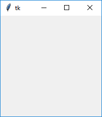
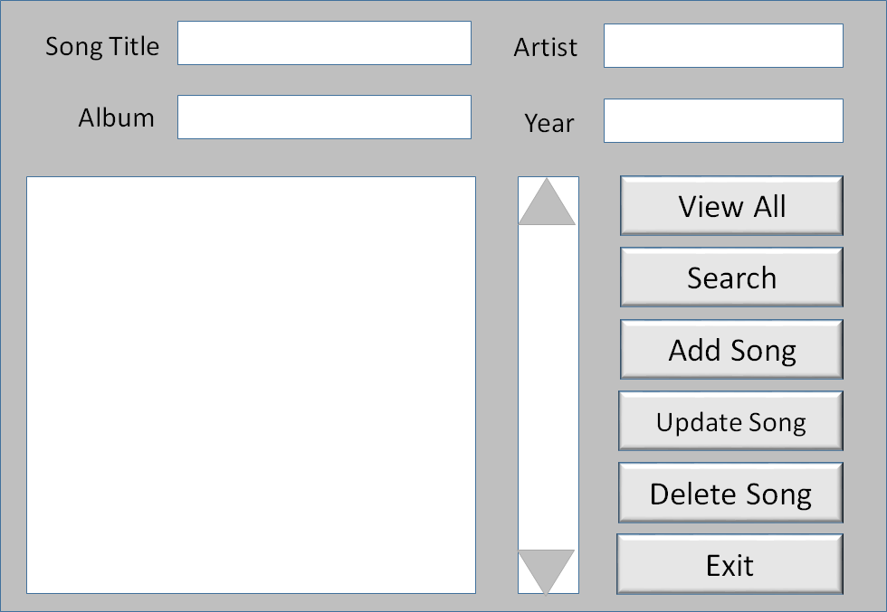
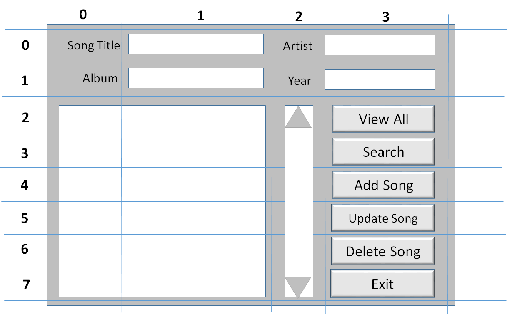

#w08c22

Applications must present some form of interfaced - and though not always the case, we often must develop our program to interface with a "human". If we look at the evolution of the human computer interaction (HCI), we find an increasing expanding arena of possibilities - from command line terminal like interfaces, to Elexa like natural language interfaces. This week we look at one HCI these approach, Desktop GUI programming in Python.

To develop GUI's in Python we need to import and use specialized packages. There are a number of common packages used by Python GUI programmers. Programming GUI's for cross platform use requires a framework. These frameworks are typically independent of the language, but languages have bindings through which to create GUI's based on these frameworks. The most common of these frameworks include [Gtk](http://www.gtk.org/) (GNU LGPL license), [Qt](https://www.qt.io/) (commercial license), [Tk](http://wiki.tcl.tk/477) (very open licensing from University of California), and [wxWidgets](https://www.wxwidgets.org/) (A modified Library General Public License that let's you commercialize any derived products).

The most popular is Tkinter (it's part of the standard python distribution) which binds to and uses Tk. We will use Tkinter for this portion of the course because Tkinker if part of the standard Python library

Note on GUI builders - there doesn't seem to be a defacto standard for Python Tkinker (you can look at PAGE, Pygubu). You're welcomed to google and explore the various options.  We will only build simple interfaces without the need to employ a GUI builder. My objected in wrt to GUI development is to simply familiarize you with the Tkinker framework, and if you choose to build a GUI for your final project, you have a foundation from which to understand how to build a GUI based system.

## Aside: creating an exe from Python.
If we wish to create a Python application that we can distribute to users, it would be quite useful to not require the user to have Python installed. ...


# Basic tkinter

GUI programming can be thought of as event driven programming. Which code is executed within our program is the response to events that are generated by various widgets found within out GUI.


Let's start with the basic framework:

```python
import tkinter
window = tkinter.Tk()

# insert widgets here

window.mainloop()

```

This results in displaying a blank window.



If we want to create the means through which users can interact with out program, we must create widgets that allow users to generate events, and then write code the serves as handlers for any events we are interested in processing and/or responding to.

In the case of the program below, we insert a button, but the handler is a builtin tkinker method that simply destroys the window

```python
import tkinter as tk
window = tk.Tk()

# insert widgets here
button = tk.Button(window, text="It's Friday afternoon and I'm in a programming class!", width=100, height=2, command=window.destroy)
button.pack()

window.mainloop()
```

If we want to create our own handler for this event, we simply create a method and an attach it to the button. The following program will display to terminal from where the python program was launched.


```python
import tkinter as tk
window = tk.Tk()

# insert handlers here
def write_hello():
    print("hello world") # to see this display as button it push, run "python -u tkinter03.py"

# insert widgets here
button = tk.Button(window, text="It's Friday afternoon and I'm in a programming class!", width=100, height=2, command=write_hello)
button.pack()
window.mainloop()
```

If we want to change the state of our GUI is response to events, for instance, displaying text -- we can create an "event" hook or handler that received a message from a user event (generated by a widget)

Let's alter our simple program so that we add a handler for the button press event that displays different text in our window title.

```python
import tkinter as tk
window = tk.Tk()

hello = True

# insert handlers here
def write_hello():
    global hello
    if hello:
        hello = False
        window.title("GOOD BYE!")
    else:
        hello = True
        window.title("HELLO THERE!")


# insert widgets here
button = tk.Button(window, text="It's Friday afternoon and I'm in a programming class!", width=100, height=2, command=write_hello)
button.pack()


window.mainloop()
```

Now, these are the basics. We only cover the foundations aspects/key concepts for GUI programming with TKinter (and the event driven model). This can serve as a base from which you could explore developing advanced GUI's. If you want to learn more about Tkinker, you can access the latest API documentation here https://docs.python.org/3/library/tk.html.


From hereon, I'll switch to looking at an example application, and we'll work through the development of this application.


# Let's build an application: Song database

Let's learn more about Tkinker by building an application.

In this system we wish to manage a database of songs.

The following attributes of our song data much be managed:
* Song Name
* Album Name
* Artist Name
* Genre

The following actions must be supported:
* View all songs
* Search for a song
* Add a song
* Update a song
* Delete a song

## Designing our Interface: Sketch the Interface

First we need to sketch out the interface, create a Wireframe


In Tkinker we can create applications using Pack or Grid. We will be using Grid, which allows up to specify our layout using cell referencing. To help guide our development we now overlay a grid on our sketch...



## Build the Front-End

When building applications we often think of them in "tiers". In our GUI application we have two tiers, the "front-end" and the "back-end".  In this section we focus on building the front-end.


### Step 1

Let's get the titles in place.

```python
"""Program that stores song information: Song, Album, Artist, and Genre.

User can:
    View all songs
    Search for a song
    Add a song
    Update a song
    Delete a song
    Exit the application

NOTE: See wireframe.png for sketch of interface.

"""
from tkinter import *

window = Tk() # TK method that creates a windows object

l1=Label(window, text="Song")
l1.grid(row=0,column=0)

l2=Label(window, text="Artist")
l2.grid(row=0,column=2)

l3=Label(window, text="Album")
l3.grid(row=1,column=0)

l3=Label(window, text="Year")
l3.grid(row=1,column=2)

window.mainloop()
```
<center><sub>[^click here for code^](songDB01.py)</sub></center>
<br>
<br>

### Step 2

Insert text fields

```python
# Display text entry fields
song_text=StringVar()
e1=Entry(window,textvariable=song_text)
e1.grid(row=0,column=1)

artist_text=StringVar()
e2=Entry(window,textvariable=artist_text)
e2.grid(row=0,column=3)

album_text=StringVar()
e3=Entry(window,textvariable=album_text)
e3.grid(row=1,column=1)

year_text=StringVar()
e4=Entry(window,textvariable=year_text)
e4.grid(row=1,column=3)
```
<center><sub>[^click here for code^](songDB02.py)</sub></center>
<br>
<br>

### Step 3

Create a listbox and attach a scroll-bar

```python
# display listbox and attached a Scrollbar
list1=Listbox(window, height=6, width=35)
list1.grid(row=2, column=0, rowspan = 6, columnspan= 2 ) # we want to span across multiple rows and columns

sb1 = Scrollbar(window)
sb1.grid(row=2, column=2, rowspan=6)

list1.configure(yscrollcommand = sb1.set)
sb1.configure(command = list1.yview)
```
<center><sub>[^click here for code^](songDB03.py)</sub></center>
<br>
<br>

### Step 4

Insert display Buttons

```python
b1=Button(window, text="View All songs", width=12)
b1.grid(row=2, column=3)
b2=Button(window, text="Search ", width=12)
b2.grid(row=3, column=3)
b3=Button(window, text="Add Song", width=12)
b3.grid(row=4, column=3)
b4=Button(window, text="Update Song", width=12)
b4.grid(row=5, column=3)
b5=Button(window, text="Delete Song", width=12)
b5.grid(row=6, column=3)
b6=Button(window, text="Exit", width=12)
b6.grid(row=7, column=3)
```
<center><sub>[^click here for code^](songDB04.py)</sub></center>
<br>
<br>

At this stage, we have a basic GUI framework, but not handlers. Much of what these handlers we will create will do is handle data stored in a database. Considering this, let's build our "backend" database and handlers for our data.

## Build the back-end

Let's now start thinking of our application as a multi-tiered application, with a "front-end" and a "back-end". We first rename our songDB04.py file to frontend01.py and add an import backend statement.

NOTE: From hereon, I'll use the SQLite method of passing parameters into my SQL function (versus the approach of building the statement using format statements). The general approach is that your SQL strings include a question mark, and add a second tuple argument that provides all the values for any question marks found.

for example:

```python
cur.execute("INSERT INTO sometable VALUES (NULL, ?, ?, ?, ?)", (this, that, otherthing))
```
...but, also note that if we attempt to create a one item tuple, we need to include a comma character

```python
cur.execute("INSERT INTO sometable VALUES (NULL, ?)", (this,))  
```

NOTE2: A new names style of formating was recently added to python's SQLite DBI:

```python
cur.execute("select * from sometable where name_last=:who and age=:age", {"who": who, "age": age})
```


NOW, let's create our backend01.py. In this first version, we just want to create our database and table if they do not already exist. Lets also add a view method that will display all the records in our database.

```python
import sqlite3

DBASE_FILE = 'dbase/songs.db'

def connect():
    conn = sqlite3.connect("dbase/songs.db")
    cur = conn.cursor()
    cur.execute("CREATE TABLE IF NOT EXISTS song (id INTEGER PRIMARY KEY AUTOINCREMENT, title TEXT, artist TEXT, album TEXT, year INTEGER)")
    conn.commit()
    conn.close()

def view():
    conn=sqlite3.connect(DBASE_FILE)
    cur=conn.cursor()
    cur.execute("SELECT * FROM song")
    rows = cur.fetchall()
    conn.close()
    return rows

if __name__ == "__main__":
    connect()
    print(view())
```
<center><sub>[^click here for code^](backend01.py)</sub></center>
<br>
<br>


Now, let's add the other functions we'll need in order to support the front end.

```python
import sqlite3
from backend01 import *

def insert(title, artist, album, year):
    conn=sqlite3.connect(DBASE_FILE)
    cur=conn.cursor()
    cur.execute("INSERT INTO song VALUES (NULL, ?, ?, ?, ?)", (title, artist, album, year))
    conn.commit()
    conn.close()

def delete(id):
    conn = sqlite3.connect(DBASE_FILE)
    cur = conn.cursor()
    cur.execute("DELETE FROM song WHERE id=?", (id,)) # don't forget the comma or python will not interptret this as a tuple
    conn.commit()
    conn.close()

def update(id, title, artist, album, year):
    conn = sqlite3.connect(DBASE_FILE)
    cur = conn.cursor()
    cur.execute("UPDATE song SET title=?, artist=?, album=?, year=? WHERE id=?", (title, artist, album, year, id)) # don't forget the comma or python will not interptret this as a tuple
    conn.commit()
    conn.close()

def search(title="", artist="", album="", year=""):
    conn=sqlite3.connect(DBASE_FILE)
    cur=conn.cursor()
    cur.execute("SELECT * FROM song WHERE title=? OR artist=? OR album=? OR year=?", (title, artist, album, year))
    rows = cur.fetchall()
    conn.close()
    return rows


if __name__ == "__main__":
    connect()
    insert("Gettin' jiggy with it", "Will Smith", "Big Willie", "1997")
    print(view())
    done = False
    while not done:
        record_id = int(input("\n\nDo you want to delete on of these records? For yes, insert record ID. for no, insert -1. "))
        if record_id > 0:
            delete(record_id)
            print(view())
        else:
            done = True
```
<center><sub>[^click here for code^](backend02.py)</sub></center>
<br>
<br>

## Integrate the front and back end.

Here we bein the process of linking the front end to the backend. Essentially, in this step, we need to create callback functions that "hook" into the messages generated by the button presses and create functions that handle such events.

How we do this is by specifying a command parameter in our buttons that will be given the value of the function (pointer to the function, not the output from the function)

Let's add such a handler for "view all" button.

First, we need to create a function that will be called when the function is called. We can simply leave this as a stub function for now.

```python
def view_command():
    pass
```

Now, we need to hook this as a callback function to the button "view all"

```python
b1=Button(window, text="View All songs", width=12 ,command=view_command)
```

Now, whenever the button "view all" is pushed by the user, our view_command() function will be called. Notice that we do not have the option of passing any parameters to it, we will instead access the elements of the GUI we've created.


Let's look at how we might handle the first few button (View All, Search Song, Add Song).\

First, lets create out "stubs" functions that will serve as our command handlers, and create the callbacks for these handlers.


```python
"""Program that stores song information: Song, Album, Artist, and Genre.

User can:
    View all songs
    Serch for a song
    Add a song
    Update a song
    Delete a song
    Exit the application

NOTE: See wireframe.png for sketch of interface.

"""

from tkinter import *
import backend_05 as backend

def view_command():
    pass

def search_command():
    pass

def add_command():
    pass


window=Tk() # TK method that creates a windows objective

# Display Titles
l1=Label(window, text="Song")
l1.grid(row=0,column=0)

l2=Label(window, text="Arist")
l2.grid(row=0,column=2)

l3=Label(window, text="Album")
l3.grid(row=1,column=0)

l3=Label(window, text="Year")
l3.grid(row=1,column=2)

# Display text entry fields
song_text=StringVar()
e1=Entry(window,textvariable=song_text)
e1.grid(row=0,column=1)

artist_text=StringVar()
e2=Entry(window,textvariable=artist_text)
e2.grid(row=0,column=3)

album_text=StringVar()
e3=Entry(window,textvariable=album_text)
e3.grid(row=1,column=1)

year_text=StringVar()
e4=Entry(window,textvariable=year_text)
e4.grid(row=1 , column=3)

# display listbox and attached a Scrollbar
list1=Listbox(window,height=6, width=35)
list1.grid(row=2, column=0, rowspan=6, columnspan=2 ) # we want to span across multiple rows and columns

sb1 = Scrollbar(window)
sb1.grid(row=2, column=2, rowspan=6)

list1.configure(yscrollcommand=sb1.set)
sb1.configure(command=list1.yview)

# Display Buttons
b1=Button(window, text="View All songs", width=12 ,command=view_command)
b1.grid(row=2, column=3)
b2=Button(window, text="Search ", width=12, command=search_command)
b2.grid(row=3, column=3)
b3=Button(window, text="Add Song", width=12, command=add_command)
b3.grid(row=4, column=3)
b4=Button(window, text="Update Song", width=12)
b4.grid(row=5, column=3)
b5=Button(window, text="Delete Song", width=12)
b5.grid(row=6, column=3)
b6=Button(window, text="Exit", width=12)
b6.grid(row=7, column=3)

window.mainloop()
```

Now, let's fill in the code for "View All". Notice that are accessing one of our GUI objects (list1) and our database (view the backen.view() method))

```python
def view_command():
    list1.delete(0, END)
    for row in backend.view():
        list1.insert(END, row)
```
Note: We must delete anything that is already in the list box. We have the value END which will signal to delete to delete until the end of the list.

Now, let's fill in the code for search:

```python
def search_command():
    list1.delete(0, END)
    for row in backend.search(song_text.get(), artist_text.get(), album_text.get(), year_text.get()):
        list1.insert(END, row)
```
Note: We are using the StringVar object from Tk. We've already created these and linked them to our text field. We can thus query then at any time in order to get the current value of these fields.

Finally, (at least for today) complete the add callback function:

```python
def add_command():
    backend.insert(song_text.get(), artist_text.get(), album_text.get(), year_text.get())
    list1.delete(0,END)
    list1.insert(END,(song_text.get(), artist_text.get(), album_text.get(), year_text.get()))
```

Now, putting it all together we get

```python
"""Program that stores song information: Song, Album, Artist, and Genre.

User can:
    View all songs
    Serch for a song
    Add a song
    Update a song
    Delete a song
    Exit the application

NOTE: See wireframe.png for sketch of interface.

"""

from tkinter import *
import backend_05 as backend

def view_command():
    list1.delete(0, END)
    for row in backend.view():
        list1.insert(END, row)

def search_command():
    list1.delete(0, END)
    for row in backend.search(song_text.get(), artist_text.get(), album_text.get(), year_text.get()):
        list1.insert(END, row)

def add_command():
    backend.insert(song_text.get(), artist_text.get(), album_text.get(), year_text.get())
    list1.delete(0,END)
    list1.insert(END,(song_text.get(), artist_text.get(), album_text.get(), year_text.get()))


window=Tk() # TK method that creates a windows objective

# Display Titles
l1=Label(window, text="Song")
l1.grid(row=0,column=0)

l2=Label(window, text="Arist")
l2.grid(row=0,column=2)

l3=Label(window, text="Album")
l3.grid(row=1,column=0)

l3=Label(window, text="Year")
l3.grid(row=1,column=2)

# Display text entry fields
song_text=StringVar()
e1=Entry(window,textvariable=song_text)
e1.grid(row=0,column=1)

artist_text=StringVar()
e2=Entry(window,textvariable=artist_text)
e2.grid(row=0,column=3)

album_text=StringVar()
e3=Entry(window,textvariable=album_text)
e3.grid(row=1,column=1)

year_text=StringVar()
e4=Entry(window,textvariable=year_text)
e4.grid(row=1 , column=3)

# display listbox and attached a Scrollbar
list1=Listbox(window,height=6, width=35)
list1.grid(row=2, column=0, rowspan=6, columnspan=2 ) # we want to span across multiple rows and columns

sb1 = Scrollbar(window)
sb1.grid(row=2, column=2, rowspan=6)

list1.configure(yscrollcommand=sb1.set)
sb1.configure(command=list1.yview)

# Display Buttons
b1=Button(window, text="View All songs", width=12 ,command=view_command)
b1.grid(row=2, column=3)
b2=Button(window, text="Search ", width=12, command=search_command)
b2.grid(row=3, column=3)
b3=Button(window, text="Add Song", width=12, command=add_command)
b3.grid(row=4, column=3)
b4=Button(window, text="Update Song", width=12)
b4.grid(row=5, column=3)
b5=Button(window, text="Delete Song", width=12)
b5.grid(row=6, column=3)
b6=Button(window, text="Exit", width=12)
b6.grid(row=7, column=3)

window.mainloop()
```
<center><sub>[^click here for code^](frontend_04.py)</sub></center>
<br>
<br>
