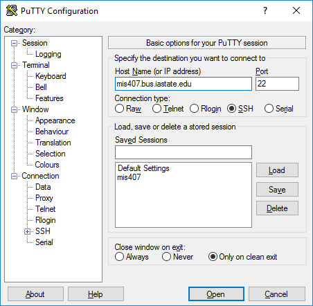

# Connecting to Linux

Servers often are run without an graphical user interface. The most common way to access and manage a Linux server is through a terminal connect from another computer.

SSH (Secure Shell) is an open source secure terminal shell that allows you to securely manage a server remotely.

Putty is a free, but "bare bones" SSH client. SFTP is also a secure file transfer proposal that is included in this putty suite.

NOTE: There are graphical user interfaces for windows that use SFTP that you might find better for simple file transfer -- BUT, only sftp is installed in class.

# putty
Putty is an ssh terminal.

Search for and start putty. Then enter the address for the server.



### PSFTP

Open a connection to mis407.bus.iastate.edu.

* find and run PSFTP
* once run, you will see a console. type...
``
open mis.bus.iastate.edu
``

Once logged in, you can move within the remote file system using cd and ls.
To access your local filesystem, you can use lcd and !ls.
To push a file on the server:

```python
put myfile.dat
```

or is you wish to put the file on the server as a new name.
put myfile.dat servermyfile.dat

If you wish to move a local directory to the server:

```python
put -r mydir
put -r mydir newname
```
